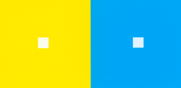
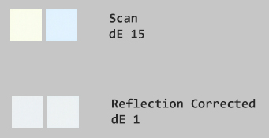
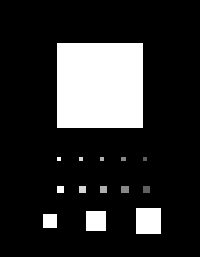
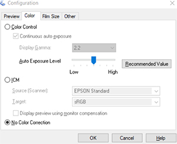
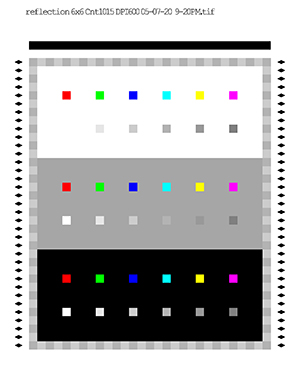
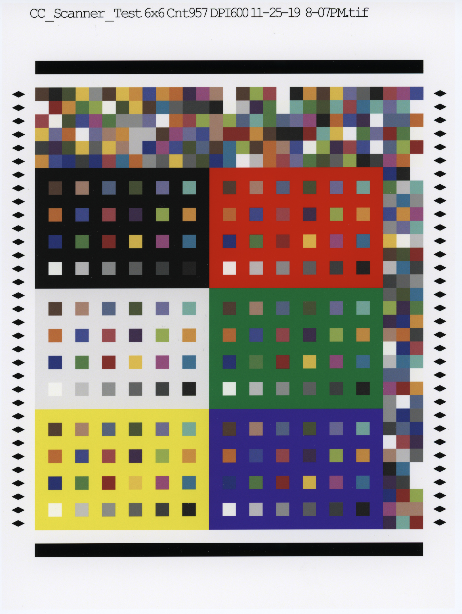
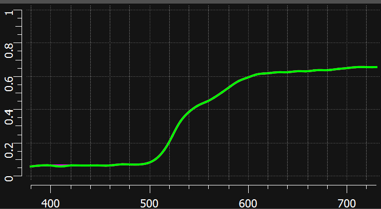

# scanner_refl_fix
# scanner_refl_fix
## A Program to correct Large Area Spatial Crosstalk and tools to make ICC profiles using Argyll software

*scanner_refl_fix* provides 2 main functionalities. Firstly, it removes light that is reflected
from surrounding scanner structures which can significantly alter image colors. Secondly, it can produce
high quality scanner ICC profiles using arbitrarily large numbers of patches when used in conjunction with
Graeme Gill's free Argyll software and an XRite I1iSis or I1Pro2 spectrophotometer.

### Removing  large area glare from reflection scans

Scanner glare occurs when light illuminating the document being scanned reflects back to the other surfaces
then back again to the document adding to the illumination already there. This changes the total illumination
level and tint which alters colors seen by the scanner's optics.

Aside from metameric failure, scanner glare is the single largest cause of scanner delta E errors and difficulties making good profiles. Worse,
large area glare cannot be corrected by ICC profiles because it causes big variations in the scanned RGB values
before they ever get to a profile. Correcting for this by allows significantly more accurate profiles to be made providing
consistent, colorimetric scans.

Experiments show the worse case is when white regions are surrounded by
large regions of yellow or cyan as shown here:

**Surrounding colors induce error shifting  white patches toward surrounding color** 

These unprinted, "white" patches shown below are 6mm square and show how large this re-reflected light shifts the tints of the white squares.
this was from an Epson V850 scanner. The top two are uncorrected, the bottom two after correction by *scanner_refl_fix* 

**White Patch Reflection Error** 

Removing unwanted reflected light also improves the accuracy of ICC profiles since the RGB patches
in a target patch set are no longer affected by the nearby patch colors. For example, scanning a
randomized set of ColorChecker colors, each duplicated 10 times, improves the ave. delta E 1976
from 1.02 to 0.42 using a 2871 count patch set after the tif images had reflected light removed. Even
profiles made using XRite's IT8 improved a bit from dE 3.92 to 3.47. The three factors that reduced
the IT8 accuracy from the most significant were:

- Metameric failure. This is where the scanner's light source and RGB color filters deviate from
the Luther/Ives criteria AND when the spectrum differs between two
supposedly identical colors. These are specific to a scanner's design.
For the V850, oranges have quite different spectra between CYMK printed
and photo-chemistry of the IT8 chart.
- Actual errors in measured colors. The IT8 chart was not individually measured and photochemistry is
quite sensitive to small changes when the chart batches are made.
- The small number of patches in an IT8 chart which has just over 200 colors.

### This is how it works.

A matrix model of scanner glare (spatial crosstalk) is created and saved as the text file "scanner_cal.txt." This
model characterizes the scanner's reflection glare and is not media sensitive. It only needs to be made once for the
model of scanner. Then, the program can be used remove reflected glare light from scanned tiff files
regardless of the media being scanned. No special tools or other software are needed.

Test charts are provided for measuring the effectiveness of the scanner reflection removal.

Additional options are provided to embed an ICC scanner profile and batch convert a set of tiff files, amongst others.

**Provides tools useful for creating ICC profiles using i1Pro 2 or i1iSis spectrophotometers**

Additionally, printed patch charts can be scanned to make CGATs RGB files. If a CGATs measurement file is available
containing LAB values such as one might get from an XRite i1iSis, or I1 Pro spectrophotometer,
this additional data can be combined to make an CGATs file with scanned RGB and measured LAB values.
This can then be used with open source Argyll tools to create an ICC scanner profile. Charts are provided
with 2871 patches in US Letter size formatted for reading with X-Rite's I1iSiS spectrophotometer.
A smaller patch set is included for use with I1Pro 2

### The Problem in Detail
Reflection desktop scanners have an intrinsic non-linearity from light reflected from nearby image areas.
Lighter portions of a scanned image that are in the immediate surround of the point being scanned
reflect of light in proportion to this region's brightness. Some of this illuminates structures
that are about 10mm from the top and bottom of the slot which is being scanned.
When the image is all or near "white," the light which is reflected from the paper to the frosted surfaces then
back to the paper can be almost 20% of the light originally illuminating the paper. On my Epson V850 scanner the
reflected light from an unprinted sheet of Canson Photographique Matte adds slightly over 20%.

An IEC standard, 61966-8, describes this as "Large Area Spatial Crosstalk."
This causes a scanned image colors to be slightly shifted by the additional reflected light.
Areas surrounded by white will increase in brightness. Areas surrounded by a strong color will
be shifted in the direction of that color.

## Walkthrough of Typical ScannerRefFix uses
### Initially Calibrating the Scanner
Initially one needs to create the scanner reflection model. This only
needs to be done once. First print a special
chart, *scan_calibration.tif* using Rel. Col. Intent at 100%.
This contains various sized white squares embedded
in black surrounds. The paper and printer
used is not important. It is not necessary to use the same paper or even paper type or printer.
However, the calibration is specific only to this scanner model.

When this print is scanned, the tif image is then processed to calculate the way light is reflected from
nearby internal surfaces.  This spatial reflection is  modeled as a 2D matrix and stored as the file
*scanner_cal.txt*. This calibration file should be in the same directory as subsequent executions of
*scanner_refl_fix*.

**Image analyzed to create reflection correction data **
*scan_calibration.tif*   

The print must be scanned at 200 DPI without any corrections or conversions to a colorspace
but just the native scanner's RGB in a tiff format. Shown are the settings for the Epson V850.

**Epson V850 Scanner RAW Settings** 

    scanner_refl_fix -c scan_calibration_glossy.tif

Analyzes *scan_calibration_glossy.tif* and creates a calibration matrix file, *scanner_cal.txt*,
which will be used to model extra light that is reflected back onto the document.
It also prints some statistical data the correction produces.

    Reading scanner reflection calibration file and creating "scanner_cal.txt"
    Gammas: 1.59
    Uncorrected reflection rms err 11.04378
    Corrected reflection rms err 0.95490

The file *scanner_cal.txt* contains info fields and a 19x19 matrix with each entry representing
the amount of light reflected from media in grid squares of 0.10 inches.

    "scanner_cal.txt"
    scanner "scan_calibration_glossy.tif"  "Aug 12 2020 13:26:14"
    gamma 1.585
    grid_size 19
    grid_dpi 10
     0.00000  0.00000 ...
     0.00000  ...
     ....

The second entry in the first line of the created calibration file *scanner_cal.txt* can be edited.
The default is the calibration tif file. I recommend using the name/model of the scanner.
This file should be placed in the same directory that the program is
executed (not the location where the program binary or executable is located).

### Correcting scans
Now you are ready to correct new scans. The simplest way to use *scanner_refl_fix* where
the first argument is the scan to be reflection corrected
and the second argument is the file name for corrected scan.
Alternately the option "-B" will fix one or more tif files and automatically postpend "_f"
to the main tif file name. This is useful for automatically converting multiple scans. If you
have already made an input profile for your scanner the option *-B profilename.icm* will
cause the program to attach the profile to tif file. This makes it very convenient to convert
multiple files and each will have the profile attached. For instance:

    scanner_refl_fix -P scannerv850.icm -B scane1.tif scan2.tif scan3.tif ...

If you have a spectrophotometer, see the section "Creating a Scanner ICC Profile using Argyll and I1Profiler"
below to use this program to make scanner ICC profiles.

### Checking how well scans are corrected for reflection

To test the effectiveness of the reflected light removal, a special chart, *reflection.tif*,
is provided with Red, Green, Blue, Cyan, Yellow, Magenta
and Neutral (white/gray) patches surrounded by white, a middle gray, and black.

&nbsp;&nbsp;&nbsp;&nbsp;&nbsp;&nbsp;**reflection.tif**-Used for verification 

To test your scanner, print the chart *reflection.tif* using Adobe's ACPU or other
program that can print w/o color management, then scan it.
Then run the following command to remove the reflected light.

    scanner_refl_fix scan_reflection.tif scan_reflection_f.tif

The program can then be used to measure RGB averages of the scanned
patches along with the max
RGB differences (second number labeled 'd' adjacent to the R, G, B values) 
that occur from white background scanner reflections.
The black background produces little reflected light.
the "d" value is the difference between R, G, or B values between the white background and black background.
For example, taking the White patch's red channel, the average is 232.2 and the "d" value is 24.3.
The White patch's "r" channel measures about 246 in the white surround and 222 in the black surround.

Here's the command and results using the scanned, uncorrected tif image:

    scanner_refl_fix -s scan_reflection.tif

    Analyzing Reflection Chart RGB Variations
    File:scan_reflection.tif ,Rows:35, Cols:29

    Neutrals
       White  d    Gray 9  d    Gray 8  d    Gray 7  d    Gray 6  d    Gray 5  d
    R  232.5 23.9   199.6 21.4   165.3 18.9   141.1 16.1   116.2 14.0    93.2 11.8
    G  236.2 24.1   199.9 22.6   167.2 18.1   142.4 16.8   116.5 14.5    92.8 11.8
    B  241.4 23.9   203.0 22.4   167.7 19.3   140.5 16.2   113.9 14.1    91.3 11.7

    Colors
         Red  d     Green  d      Blue  d      Cyan  d    Yellow  d   Magenta  d
    R  173.6 16.4    34.7  5.7    66.4  7.7    35.1  5.0   224.4 25.4   171.4 18.0
    G   34.1  5.0    97.7 11.5    45.2  5.4   123.5 14.0   210.7 24.4    45.7  5.5
    B   20.3  3.7    52.4  7.1   144.8 15.0   208.8 23.0    68.4  8.3    94.2 10.2
    Average of all channel stds:  7.53

And here's the command and results from the reflection corrected tif image:

    scanner_refl_fix -s scan_reflection_f.tif

    Analyzing Reflection Chart RGB Variations
    File:scan_reflection_f.tif ,Rows:35, Cols:29

    Neutrals
       White  d    Gray 9  d    Gray 8  d    Gray 7  d    Gray 6  d    Gray 5  d
    R  229.6  1.7   197.9  1.1   164.7  2.3   140.9  1.6   116.4  2.3    93.6  2.5
    G  232.8  2.9   198.0  0.7   166.3  1.6   142.1  1.7   116.5  2.4    93.0  2.4
    B  237.5  4.8   200.7  1.7   166.7  1.1   140.1  1.3   113.9  2.0    91.5  2.3

    Colors
         Red  d     Green  d      Blue  d      Cyan  d    Yellow  d   Magenta  d
    R  172.8  1.9    34.9  2.0    66.7  1.7    35.4  1.3   221.9  0.4   170.7  0.5
    G   34.4  1.4    97.9  1.2    45.5  0.9   123.5  0.6   208.5  0.5    45.9  0.8
    B   20.5  1.7    52.7  1.4   144.3  2.1   206.4  1.7    68.6  0.9    94.4  0.5
    Average of all channel stds:  0.84

Note that the average standard deviations of the RGB channels is reduced from 7.66 to .89

## Creating a Scanner ICC Profile using Argyll and I1Profiler

*scanner_refl_fix* can also be used to create high quality ICC scanner profiles.
This requires XRite's I1Profiler
and a uV cut (M2) spectrophotometer but does not require XRite licenses as it only uses I1Profiler to extract
profile measurement data. Provided are a CGATs RGB file and Tif images of the corresponding targets.
It is strictly not necessary to use the supplied targets. I1Profiler can create arbitrary,
multi-page charts that are sized appropriately for spectrophotometers such as the i1Pro 2 or i1iSis.
However, the provided charts should be easier to use and results can be compared with the
provided samples for both the i1Pro2 and i1iSis spectrophotometers.

### Using the i1iSis Spectrophotometer
For XRite's i1iSis, a 3 page USA Letter format is recommended.
Included are a CGATs RGB file and printable images of the 2871 patches over 3 pages.
The first two pages are color patches and the third page is devoted to near neutrals where
color perception is very sensitive to small hue shifts.
The printed tif images can be scanned then spectrophotometer measured for Lab values with the i1iSis.
First open i1Profiler then load the RGB CGATs file (*patchs_2871.txt*) into the Patches tab.
Next select USA letter size and profile orientation on the Test Chart tab. The defaults will produce
3, 957 patch images totaling 2871 patches. Print the supplied charts or the charts from I1Profiler and let dry.
Then measure the charts with M2 (no uV) since scanners have no significant uV.
Check to make sure they match the printed/scanned images. Then save the measured files as CGATs
making sure that the saved files include the LAB values. Defaults should be fine as they include LAB values.

Samples from my printer/scanner are provided for comparison as well as a batch command
file *process_i1isis_scans.bat* to execute these commands on the sample files created from this process.

Then we scan the 3 charts saving the tif files as scanner3pgcg(1-3).tif and correct for reflections.The
corrected scans will be labeled with "-f" postpended to the names creating scanner3pgcg(1-3)_f.tif

    scanner_refl_fix -B scanner3pgcg1.tif scanner3pgcg2.tif scanner3pgcg3.tif

Next we generate the required Argyll CGATs file that contains scanner RGB values and
corresponding LAB values from the I1Profiler measurements then execute Argyll commands to create the profile.
The "-M" option then reads the patch RGB values from patches
from the tif files (*scanner3pgcg(1-3)(_f).tif*) then adds the LAB values
from the CGATs spectro measurement file (*scanner3pgcg_M2.txt*) and finally creates
CGATs files with RGB and associated LAB values. One for making a standard scanner profile
from the uncorrected scans and one from the corrected scans.

    scanner_refl_fix -M scanner3pgcg1.tif scanner3pgcg2.tif scanner3pgcg3.tif scanner3pgcg_M2.txt scanner_isis.txt
    scanner_refl_fix -M scanner3pgcg1_f.tif scanner3pgcg2_f.tif scanner3pgcg3_f.tif scanner3pgcg_M2.txt scanner_isis_f.txt

The "-M" option on the fixed scans prints out summary stats and a similar one for making standard (unfixed) profiles:

    Processing image patch files
    File:i1isis/scanner3pg1cg_f.tif ,Rows:33, Cols:29
    File:i1isis/scanner3pg2cg_f.tif ,Rows:33, Cols:29
    File:i1isis/scanner3pg3cg_f.tif ,Rows:33, Cols:29

      Deciles:  Center                     Half                        Edge
    Chart 0:     1.1   1.1   1.1   1.1   1.1   1.1   1.1   1.5   4.6  11.1
    Chart 1:     1.1   1.1   1.1   1.1   1.1   1.1   1.4   2.7   8.2  15.1
    Chart 2:     1.0   1.0   1.0   1.0   1.0   1.1   1.4   3.2   9.6  18.5

    Associated CGATs measurement text file: i1isis/scanner3pgcg_M2.txt

    Output RGBLAB CGATs file:i1isis/scanner_isis_f.txt, Patches:2871
    High: Scanner RGB:  227.9 231.8 237.6   Lab:   94.71  -1.48  -1.93
     Low: Scanner RGB:    8.9  10.6  10.4   Lab:    1.88   0.05  -0.40

Then run a Windows script file on the original and corrected scan RGBLAB CGATs files to create ICC profiles:

    makescannerargyll scanner_isis
    makescannerargyll scanner_isis_f

Using Argyll utlities, these create ICC input profiles named: *scanner_isis.icm* and *scanner_isis_f.icm*.
This script file (*makescannerargyll.bat*) has a few entries that imports the CGATs RGBLAB file for Argyll
to create a scanner input profile.
The first line changes the Argyll algorithm to conform with ICC's definition of Abs. Col. intent.
The second line processes the CGATs file so it is interpreted as an input data set.
The third line generates the profile. Setting the `-r' option to .2 works quite well with the i1iSis
spectrophotometer but I would suggest .5 for the i1Pro 2. which isn't quite as consistent as the iSis.

    set ARGYLL_CREATE_WRONG_VON_KRIES_OUTPUT_CLASS_REL_WP=1
    txt2ti3 -i -v %1.txt %1
    colprof -r .2 -v -qh -ax -ua -D %1.icm -O %1.icm %1

Argyll's profile creation completes and shows the following results:
*colprof* generates the scanner profile and terminates with:

    3 page profile using an i1iSis spectro:
    Profile check complete, peak err = 3.559060, avg err = 0.491142
    
    With reflection corrected 3 page profile using an i1iSis spectro:
    Profile check complete, peak err = 2.774469, avg err = 0.315250

These profiles are then installed in any computer and can be attached to scanned tif images
to provide accurate colorimetric data. Generally the images should be converted to a standard colorspace
like sRGB, Adobe RGB, or ProPhoto RGB. The latter will ensure no gamut clipping should the image contain
colors more saturated than can be represented in smaller spaces.

### Using the i1Pro 2 Spectrophotometer

See *Using the i1iSis Spectrophotometer* above for details that apply generally to spectrophotometers

For XRite's i1Pro2 a 1 page USA Letter format is supplied.
Included are CGATs RGB files and printable image of 522 patches in landscape.
The printed tif image can be scanned then spectrophotometer measured for Lab values with the i1Pro2.
First open i1Profiler then load the RGB CGATs file into the Patches tab.
Next select USA letter size and landscape orientation. The defaults will produce
a 522 patch image. Measure with M2 (no uV) since scanners have no significant uV.
Check to make sure they match the printed/scanned images.
Samples from my printer/scanner are provided for comparison.

I1Pro2 charts are printed in landscape but scanned in profile to fit in the scanner.
This requires that the top (titled portion) of the landscape scan be on the left side when scanned.
The "-ML" option then reads the patch RGB values properly, ie:

    scanner_refl_fix -ML chart-522_f.tif Pro1000 CG Chart 522 Patches_M2.txt scanner_i1pro2_f.txt

Then run the following Windows script file, a small Windows script file, to
create the ICC profile *scanner_522.icm*.

    makescannerargyll scanner_i1pro2_f

## Usage
*scanner_refl_fix* is written in C++17 and uses standard C++ libraries with the exception of the
widely available libtiff and its dependents. This repo uses Windows x64 with libtiff included through vcpkg.
While not tested on other OS's it is standard C++ and should port easily to Linux and Apple OS.
Executing *scanner_refl_fix* shows various usages:

    Version 2.1.0
    Usage: scanner_refl_fix                [zero or more options] infile.tif outfile.tif
      -A                                   Correct Image Already in Adobe RGB
      -B tif file list                     Batch mode, auto renaming with _f
      -C calibration_file                  Use scanner reflection calibration text file.
      -M[L] charts... measurefile outfile  Make CGATS, chart1.tif ... CGATSmeasure.txt and save CGATS.txt
      -M[L] charts... outfile              Scan patch charts and save CGATs file
      -P profile                           Attach profile <profile.icc>
      -S edge_refl                         ave refl outside of scanned area (0 to 1, default: .85)
      -s reflection.tif                    Calculate statistics on colors with white, gray and black surrounds
      -W                                   Maximize white (Like Relative Col with tint retention)

                                           Advanced and Test options
      -b batch_file                        text file with list of command lines to execute
      -c scanner_cal.tif  [Y values]       Create scanner calibration file from reference scan.

      -F 8|16                              Force 8 or 16 bit tif output]
      -I                                   Save intermediate files
      -N gain                              Restore gain (default half of refl matrix gain)
      -R                                   Simulated scanner by adding reflected light
      -T                                   Show line numbers and accumulated time.    scannerreflfix.exe models and removes re-reflected light from an area
    approx 1" around scanned RGB values for the document scanners.

#### Most common commands

The essential, first use of *scanner_refl_fix*, is to generate the file *scanner_cal.txt*
which contains the scanner's matrix and estimated gamma. It must be in the current working directory.
It works for all paper types but has to be created for each
physical scanner model. See earlier description of how to print and scan the calibration file.

    scanner_refl_fix -c scanner_cal.tif

Normal, day to day use is estimating then removing extra reflected light.

    scanner_refl_fix image.tif image_f.tif

For processing multiple image files the "-B" option reducing typing. It processes image files and saves
the corrected images using the original names with *_f* postpended.
This is most useful for processing lots of RAW scanned images. For instance

    scanner_refl_fix -B image1.tif image2.tif ....imageN.tif

will produce the same result as 

    scanner_refl_fix image1.tif image1_f.tif
    scanner_refl_fix image2.tif image2_f.tif
    etc

A useful command is combining this with the "-P" option which will attach an ICC profile
to the corrected image(s). The "-P"  option can also be used when correcting a single file.

    scanner_refl_fix -P scannerprofile.icm -B image1.tif image2.tif ....imageN.tif
    scanner_refl_fix -P scannerprofile.icm image1.tif image1_f.tif

The following command can be used to create high quality scanner ICC profiles by combining the RGB values of patches
with the associated measured CGATs file that contains LAB values. See description of this process earlier.

    scanner_refl_fix -M[L] charts... measurefile.txt outfile.txt

The "-S" option can be used to fine tune the actual reflectance of the white area surrounding the scanned image region.
The default is .85, or 85% of light is reflected and is typical of most papers.

    -S edge_refl

This option is handy to simulate conversion where the resulting image is designed to viewed where white
is RGB 255,255,255. It's kind of similar to Relative Colorimetric except that it retains the tint of
the image. This is desired since the tint of a scanned image should be retained. Useful for
putting a scanned image on the Web. However, this is only useful if the scanned image has areas of white or near white.
For instance if you scan an 18% gray card with no white borders and use the "-W" option it will
turn the card image into a white card.

    -W

For best results when the image is intended for subsequent printing, this option should not be selected.
Instead use Absolute Colorimetric to print the reflection corrected image.
This will produce the closest match to the original document.

## Installation

The Release version includes the binary for a Windows 7-10, 64 bit executable.
The C++ source code for the program and a Solution file for Visual Studio 2019 is also included.
The source code uses ISO standard C++17 code. It requires the TIFFLIB library which can
be easily installed using the Visual Studio's vcpkg which also includes libs for Linux and iOS cross-compiling.
This has been tested on Windows 10 and both x86 and x64. The latter executes somewhat faster.

Also included are scans and CGATs spectros of i1Pro2 and i1iSis targets used to make profiles for an Epson V850
using a Canon Pro1000 printer to make the targets. ICC profiles were created using Argyll's free
software which Graeme Gill has so generously contributed to the color management community.

4 ICC profiles are included for the V850 scanner for both reflection fixed, and unfixed using the 2871 patch
set with the i1iSis and the 522 patch set for the i1Pro 2.

## Performance

To test the performance a chart was made with the 24 colors measured from an X-Rite Colorchecker.
These were organized using black, white, yellow, red, green, and blue surrounds.
Also each color, duplicated 10x, was randomly placed along the top and right side.

These were printed using Abs. Col. and measured with the i1iSis. They were also scanned
and tested with and without reflection correction using a range of profile patch counts.
To gather information on how the number of patches used to create a scanner profile affects accuracy,
I created sets of profiles with varying numbers of patches as well as a standard IT8 chart.
The following is the result with a very high OBA glossy paper. Values are mean delta E 1976.
(Except for the IT8, the same paper was used to calibrate and profile the scanner):

    Description                  6 CCs  6 CCs Neutrals   Scattered   Scattered Neutrals
             2871 Patches         2.59       2.69            1.02          0.93
             1729 Patches         2.64       2.80            1.11          1.06
             1000 Patches         2.64       2.72            1.14          0.98
              729 Patches         2.68       2.74            1.22          1.03
              512 Patches         2.71       2.76            1.27          1.07
              343 Patches         2.78       2.80            1.41          1.12
              216 Patches         2.94       2.97            1.67          1.41
              125 Patches         3.45       3.45            2.33          2.04
              XRite IT8           4.52       3.93            3.92          3.04

      Fixed, 2871 Patches         0.55       0.46            0.42          0.35
      Fixed, 1729 Patches         0.58       0.53            0.48          0.45
      Fixed, 1000 Patches         0.69       0.59            0.62          0.52
      Fixed,  729 Patches         0.74       0.66            0.66          0.62
      Fixed,  512 Patches         0.84       0.70            0.78          0.67
      Fixed,  343 Patches         1.01       0.75            0.96          0.70
      Fixed,  216 Patches         1.23       1.04            1.19          1.01
      Fixed,  125 Patches         2.02       1.74            1.97          1.70
      Fixed,  XRite IT8           3.48       2.84            3.47          2.84

Note that the XRite IT8 results are from a batch of chem. photo targets and not individually measured.
They also differ spectrally from CMYK and inkjet printers and much of the higher error is metameric failure.
Comparing the spectra from a set of 5 different objects printed with CYMK and 2 different photos printed chemically,
the chem. photos had spectra very similar to the Colorchecker while all the CMYK printed material closely matched
the Canon Pro1000 spectrum.

The V850 exhibits large amounts of metameric error for some colors. the shifts due to re-reflected light.
This color, orange-yellow, exhibits the most metameric error between prints and the Colorchecker.

Accurate scans for chemical paper photographs can be done by profiling the scanner to charts rendered with
the same process then measured with a spectrophotometer.